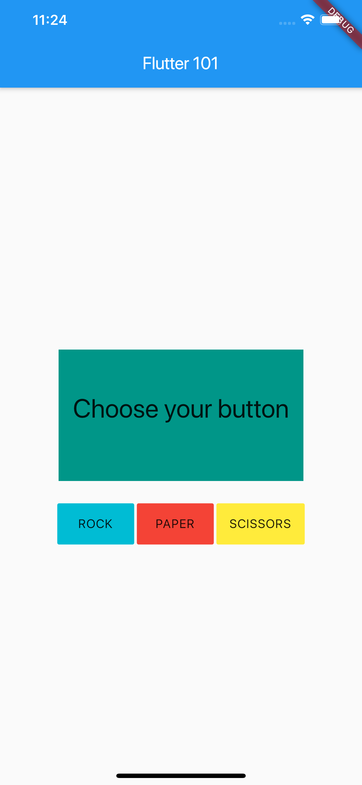

# PD Meet up 12: Flutter 101 - Rock, Papers, and Scissors game.

Demo project for the students of PHINMA - University of Pangasinan, Dagupan City, Pangasinan

## Sample Images


## Prerequisites
- [Flutter](https://flutter.dev/) - Flutter is Google’s UI toolkit for building beautiful, natively compiled applications for mobile, web, and desktop from a single codebase.

## Installation
- [Mac](https://flutter.dev/docs/get-started/install/macos)
- [Linux](https://flutter.dev/docs/get-started/install/linux)
- [Windows](https://flutter.dev/docs/get-started/install/windows)


## Usage
### Download or Clone the project.
```
    git clone https://github.com/Jansalvador1445/UPang-flutter-101
```

or Download the zip file : [Download](https://github.com/Jansalvador1445/UPang-flutter-101/archive/master.zip)

### Run the Sample Project.

Mobile 
```
    cd UPang-flutter-101
    flutter pub get
    flutter run
```

Web 
```
    cd UPang-flutter-101
    flutter pub get
    flutter run -d chrome
```

## Flutter Philippines
- [Website](https://flutter.ph/#/)
- [Meetup](https://www.meetup.com/flutterph/)
- [Twitter](https://twitter.com/flutter_ph)
- [Facebook Page](https://www.facebook.com/flutterphilippines/)
- [Facebook Group](https://www.facebook.com/groups/flutterphilippines/)
- [Github](https://github.com/flutterph)


